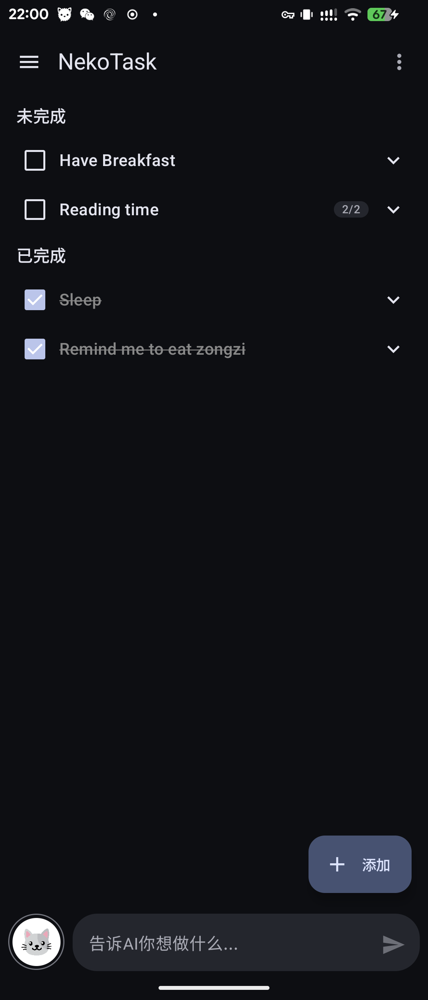
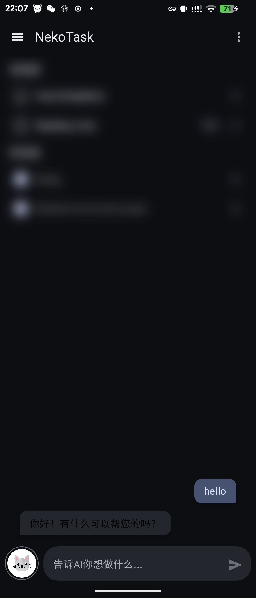
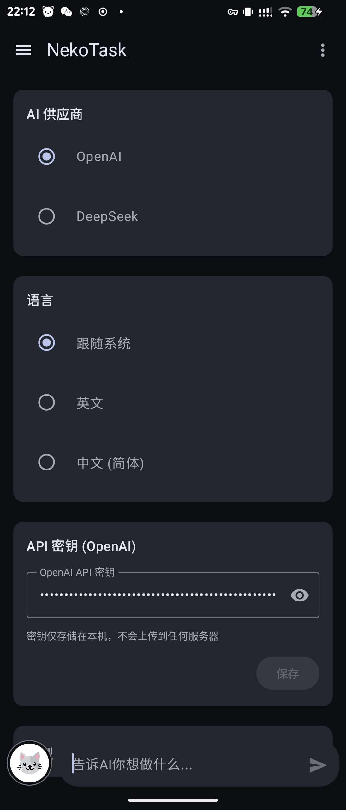

# NekoTask

NekoTask is an Android to-do app with an AI assistant, designed around low cognitive load for ADHD-friendly task capture and follow-through.

The app is currently a functional prototype. It is useful for local development and experimentation, but it is not a medical tool and should not be treated as production-ready.

## Screenshots

Images will be added here as the current UI stabilizes.

| Task List | AI Chat | Settings |
| --- | --- | --- |
|  |  |  |

## What It Does

- Manual task capture with a compact Material 3 bottom sheet, priority selection, and a two-step date/time picker.
- Hierarchical tasks and subtasks with completion state, ordering, and progress display.
- AI chat for natural-language task management, shown either as peek bubbles or a fullscreen overlay.
- AI subtask division for turning a larger task into smaller executable steps.
- Long-term memory, stored locally, for persistent assistant context managed from Settings.
- Debug-only sample data seeding and reset tools for local development.

## Why

Many task apps make users decide too much before they can start. NekoTask aims to keep the default workflow small:

- capture quickly,
- split vague work into concrete steps,
- keep the main task list scannable,
- let AI help without replacing direct manual controls.

The cat theme is intentionally lightweight: it should make the app approachable without adding visual noise.

## Current Implementation

- UI: Jetpack Compose + Material 3, single `MainActivity`.
- State: `MainViewModel` coordinates feature-level state and side effects through section coordinators.
- Data: Room is the source of truth for `tasks` and `long_term_memories`.
- AI: JetBrains Koog `AIAgent` with tool-based task and memory actions.
- Providers: OpenAI and DeepSeek are supported through the app's Settings screen.
- Networking: Ktor is adapted into Koog through `KtorKoogHttpClient`.
- Time and serialization: `kotlinx.datetime` and `kotlinx.serialization`.

Some visible drawer entries, such as Notes and About, are placeholders.

## Setup

Open the project in Android Studio or build from the command line with the included Gradle wrapper.

For debug builds, you can provide a default OpenAI key in `local.properties`:

```properties
OPENAI_API_KEY=your_api_key_here
```

Release builds do not compile the developer's API key into the app. Users are expected to enter their own provider key in Settings. AI features require a valid provider key and network access.

Useful build check:

```bash
./gradlew :app:compileDebugKotlin
```

## Documentation Split

- English documentation is preferred for project-level truth. If English and non-English docs disagree, use the English project docs and the code as the source of truth, then update stale docs.
- `README.md` explains what the app is and why it exists.
- `AGENTS.md` is the implementation and maintenance guide for agents and developers.
- `docs/SUBTASK_DIVISION.md` documents the current subtask division module.

When the implementation and documentation disagree, treat code as the source of truth and update the docs.

## Near-Term Direction

- Keep the task flow low-friction and manual-first.
- Make AI actions more reliable and transparent.
- Reduce orchestration weight in `MainScreen` as features grow.
- Tighten repository write APIs where UI needs explicit success or failure.
- Replace placeholder drawer entries with real features or remove them.
